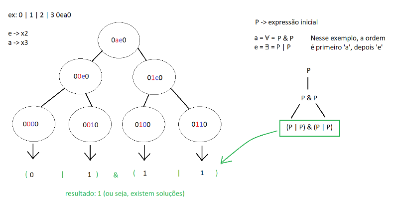

# Trabalho Prático 1: Expressões lógicas e satisfabilidade

Esta trabalho lida com dois assuntos: a avaliação de expressões lógicas, e o problema da
satisfabilidade. O primeiro, recebe uma expressão (envolvendo os operadores lógicos de negação,
conjunção, disjunção, e possíveis parêntesis) com n variáveis, e uma valoração para cada uma
delas, e retorna se, para tais variáveis, aquela expressão é verdadeira ou não. Já o segundo, não
trata de valores específicos para cada variável, mas sim se existe uma valoração que faz com que
a expressão resulte em 1. Nele, no máximo cinco variáveis são quantificadas, sendo os
quantificadores disponíveis: “e” (que simboliza ∃, ou “existe”) e “a” (∀, que representa o “para
todo”).

No total, o trabalho contou com cinco classes: duas classes para implementação das pilhas (dada
a preferência por não utilização de templates, dois tipos de pilhas foram criados: uma para lidar
com caracteres, e outra com números inteiros), uma classe para implementação de um vetor de
strings, uma para lidar com a lógica para avaliar expressões, e outra para resolver o problema de
satisfabilidade com quantificadores. Assim, três dessas classes são usadas para implementar já
citadas estruturas de dados, e duas lidam com as operações necessárias para resolução de
problemas.

