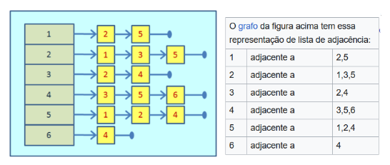
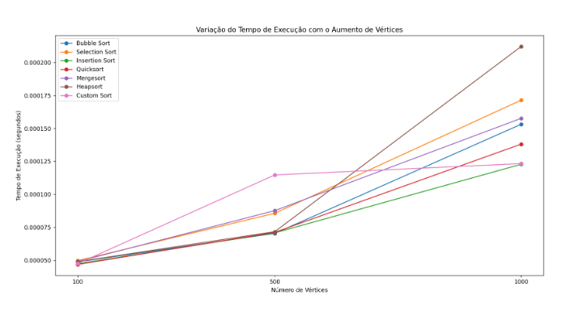

# Trabalho Prático 2: Essa coloração é gulosa?

O objetivo deste trabalho é explorar e entender se toda coloração própria de um grafo
k-colorível é, por natureza, uma coloração gulosa. Uma coloração própria de um grafo é
uma atribuição de cores aos seus vértices de tal forma que nenhum par de vértices
adjacentes — ou seja, vértices que são conectados por uma aresta — compartilhe a mesma
cor. Já uma coloração gulosa é um método específico para colorir um grafo de maneira
própria, em que cada vértice é colorido com a menor cor disponível que ainda não foi
utilizada por nenhum de seus vizinhos.
Resumidamente, o programa recebe um grafo através do terminal, seguindo uma certa
estrutura, com todos os valores, cores e ligações do grafo. Então, é feita uma análise se a
coloração passada é gulosa. Caso não seja, o usuário verá um “0” na tela. Caso seja, o
programa retorna “1” seguido dos vértices do grafo, ordenados, primeiramente, por cor
(representadas por números inteiros), e, caso alguns deles tenham a mesma cor, por valor.
Logo, o cerne desta investigação gira em torno não só de determinar a relação entre estas
duas abordagens de coloração, mas também, especialmente, de como lidar com a
ordenação dos vértices do grafo de maneira mais rápida e eficiente. Para isso, foram
analisados 6 algoritmos de ordenação mundialmente conhecidos (são eles: bubble sort,
selection sort, insertion sort, quicksort, mergesort e heapsort) e, baseado no estudos destes,
foi-se proposto um novo algoritmo customizado, levando em consideração as
especificidades desse problema.

Para representar do grafo a ser analisado, foi utilizada uma lista de adjacências, em que
cada vértice do grafo possui uma lista associada que armazena seus vizinhos.Exemplo:

Essa estrutura de dados foi escolhida em detrimento à matriz de adjacências, outro método
comum quando se trata de armazenamento de grafos, pois ela usa espaço proporcional ao
número de arestas, o que as torna mais eficientes em termos de espaço para grafos
esparsos. Além disso, como o grafo só é criado após o usuário passar os valores de seus
vértices e cores no terminal, a implementação com ponteiros faz com que ele não só não
precise ser inicialmente declarado com um tamanho fixo, como não são necessárias novas
realocações durante a adição de novos vértices.

